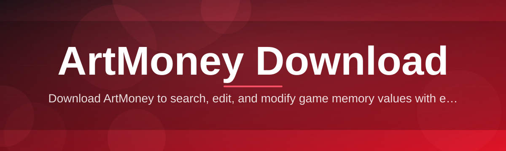
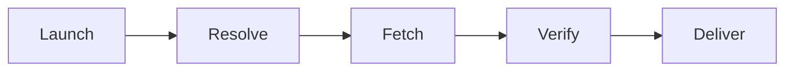

# artmoney-download-manager 🧮💾

  

*A no-nonsense manager that gets your ArtMoney download sorted, verified, and running — without the seventeen-tab treasure hunt.*

  

---

## 🎯 Overview

Let's address the room-sized elephant first: searching "ArtMoney download" on the open internet in 2026 feels like navigating a minefield blindfolded while someone whispers "just one more redirect" in your ear. Sketchy mirrors, expired links, ZIP files that smell like regret — you know the drill. This project exists because someone (me) got tired of it and decided to build the boring, reliable thing instead: a clean manager that points to a single, consistent landing page, checksums what it fetches, and gets out of your way.

`artmoney-download-manager` is not a reupload of the memory-editing utility itself. It's the **scaffolding around the download experience** — the part nobody builds because it's unglamorous. Version tracking, integrity verification, a changelog you can actually read, and a UI that doesn't look like it was designed in 2004 (even though, respectfully, the tool it fetches kind of was). Think of it as the concierge desk, not the hotel room.

Who's this for? Retro-gaming tinkerers, save-state archaeologists, people who just want to adjust a value in a single-player sandbox game without spelunking through forum threads from 2011. If you've ever typed "artmoney download" into a search bar and immediately regretted every subsequent click, this is for you.

> [!TIP]
> Bookmark the landing page. Future-you, three months from now, doing an ArtMoney download for the fourth time on a fresh Windows install, will send present-you a thank-you note.

---

## 🔥 What This Actually Does For You

1. **One canonical source, zero guesswork.** No more comparing five different "official" mirrors like you're appraising counterfeit currency. There's a single landing page, it's linked above, that's it.

2. **Version-aware fetching.** The manager knows which build it grabbed last time and tells you plainly whether a newer ArtMoney release exists — no re-downloading identical files out of paranoia.

3. **Integrity checks baked in.** Every fetched archive gets hashed and compared before it's allowed anywhere near your Downloads folder. Silent corruption is not invited to this party.

4. **A changelog that's actually a changelog.** Plain-English notes on what changed release to release, not a wall of commit hashes nobody asked for.

5. **Zero background chatter.** It runs when you tell it to run and shuts up otherwise. No telemetry theater, no "checking for updates" every 40 seconds.

6. **Portable-friendly workflow.** Keep it on a USB stick, run it on a friend's PC, walk away. No registry graffiti left behind.

7. **Dark and light themes.** Because staring at a stark white download progress bar at 1am is a crime against your retinas.

8. **Session memory.** Remembers your last-used folder path and preferences so you're not re-navigating the same directory tree every single time.

9. **Built-in FAQ panel.** Half your troubleshooting questions get answered before you even open a GitHub issue.

10. **Small footprint, honest resource usage.** This isn't going to eat your RAM for sport — it's a manager, not a browser tab hoarder.

---

## 🚀 How To Get Started

1. Visit the landing page via the download button above — it's the only link you need, so ignore anything else claiming to be "the real one."

2. Grab the latest `artmoney-download-manager` build for Windows. It's a standalone executable — no installer wizard interrogating you about toolbars you don't want.

3. Run it. Windows SmartScreen might raise an eyebrow at the unsigned binary — that's normal for small open-source tools, click through it once you've verified the source (this repo).

4. Use the built-in manager to fetch, verify, and launch your ArtMoney download. Done. Go adjust some in-game values responsibly.

> [!NOTE]
> "Standalone" means standalone. No .NET runtime scavenger hunt, no Visual C++ redistributable roulette. It just runs.

---

## 🖥️ System Requirements

| Requirement | Minimum | Notes |
|---|---|---|
| OS | Windows 10 (64-bit) | Windows 11 fully supported |
| RAM | 512 MB free | It's a manager, not Chrome |
| Disk | ~50 MB | Plus space for the actual ArtMoney download |
| Dependencies | None | Fully self-contained executable |
| .NET / runtime | Not required | Statically bundled |
| Internet | Required for fetch/verify steps | Offline mode planned |

  

---

## ⚙️ How It Works

1. **Launch** — the manager opens and reads your last-used config (or defaults on first run).

2. **Resolve** — it checks the landing page for the current ArtMoney download version metadata.

3. **Fetch** — pulls the archive over HTTPS, showing real progress, not a fake spinning wheel.

4. **Verify** — runs a checksum comparison against the published hash before unlocking the file.

5. **Deliver** — extracts (or hands off) the verified files to your chosen folder, ready to run.

> [!IMPORTANT]
> If the checksum step fails, the manager refuses to hand you the file. That's a feature, not a bug — it means something got mangled in transit and re-fetching is the correct move.

---

## 🧩 Troubleshooting — Real Questions, Real Answers

<strong>Windows Defender / SmartScreen is blocking the executable — is this normal?</strong>

Yes, for small independently-signed tools this is extremely common. Click "More info" → "Run anyway" once you've confirmed you got the file from this repo's landing page, not some rando forum post.

<strong>The manager says my ArtMoney download failed integrity verification. Now what?</strong>

Delete the partial file and re-run the fetch. Corrupted downloads usually stem from flaky connections, not anything sinister. If it fails three times in a row, open an issue with your log output.

<strong>Can I use this on Windows 7 or 8.1?</strong>

Officially, no. We test against Windows 10/11 only. It might limp along on older builds but you're on your own out there.

<strong>Does this modify any game files automatically?</strong>

No. This tool manages the download and verification of the ArtMoney utility itself. What you do with it afterward — in single-player, offline contexts — is entirely on you.

<strong>Why is there no macOS/Linux version?</strong>

ArtMoney's ecosystem is fundamentally Windows-centric, and so is this manager. Wine/Proton users have reported success but it's unsupported territory.

<strong>The progress bar froze at 99% — is my download stuck?</strong>

Usually it's the verify step, not a stall — hashing large files can take a few extra seconds on slower drives. Give it 10-15 seconds before panicking.

---

## 🎨 UI / UX Details

> [!TIP]
> Press `F1` inside the app for a quick shortcut cheat-sheet. It's faster than reading this section, but read this section anyway.

**Keyboard shortcuts:**

- `Ctrl + N` — start a new fetch session
- `Ctrl + V` — force a re-verification of the current file
- `Ctrl + O` — open the destination folder
- `Ctrl + L` — jump straight to the landing page in your browser
- `F5` — refresh version metadata
- `Esc` — cancel an in-progress download

**Themes:** Light, Dark, and a "Terminal Green" theme for the nostalgic among us.

**Settings persistence:** All preferences are stored in a local config file next to the executable — nothing phones home, nothing syncs to a cloud you didn't ask for.

---

## 🤝 Contributing & Community

This started as a personal itch-scratch and turned into something people actually rely on — which is flattering and slightly terrifying. Contributions are welcome:

- Bug reports with reproduction steps go a long way further than "it's broken."
- UI/UX suggestions are genuinely read, not just archived.
- Pull requests should be small and focused — nobody wants to review a 4,000-line diff at 11pm.

> [!WARNING]
> Please don't open issues asking for redistribution of copyrighted material outside this manager's intended scope. Keep discussions focused on the download/verification workflow itself.

Star the repo if this saved you a headache. It costs nothing and it genuinely helps visibility for a project competing against a sea of shady search results.

---

## 📜 License

Released under the [MIT License](LICENSE), 2026. Use it, fork it, remix it — just don't slap your name on it and pretend you wrote it from scratch.

---

## ⚠️ Disclaimer

`artmoney-download-manager` is an independent, community-built tool for managing the download and verification process of the ArtMoney utility. It is not officially affiliated with, endorsed by, or associated with the original ArtMoney developers. All trademarks belong to their respective owners. Use responsibly and only with software you have the right to modify — this is intended for single-player, offline, and personal-use contexts.

---

